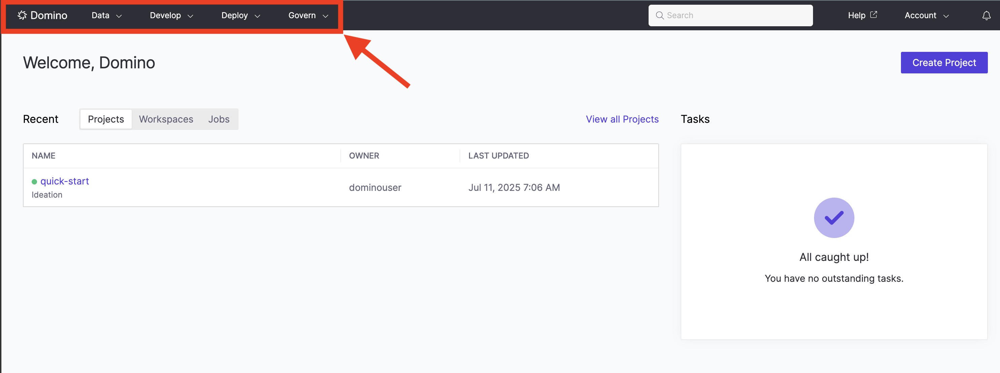
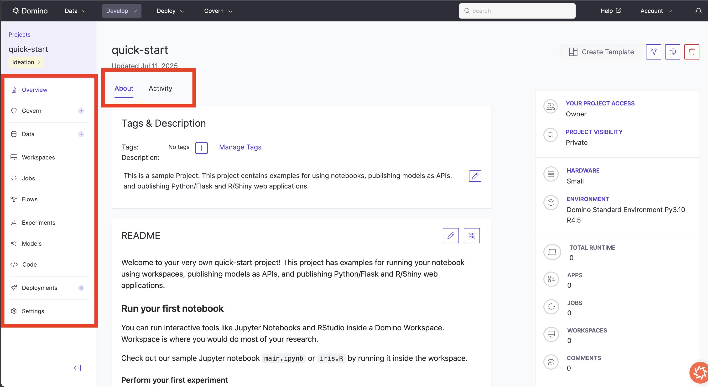
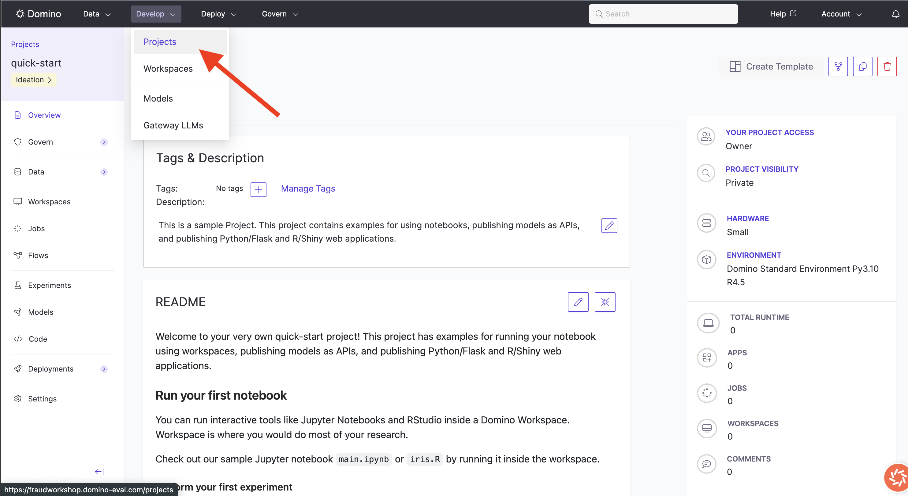
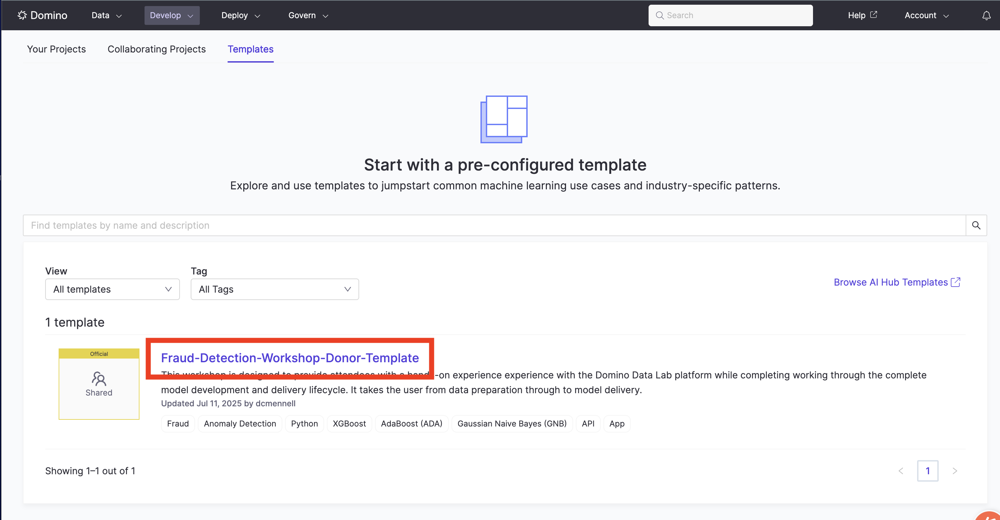
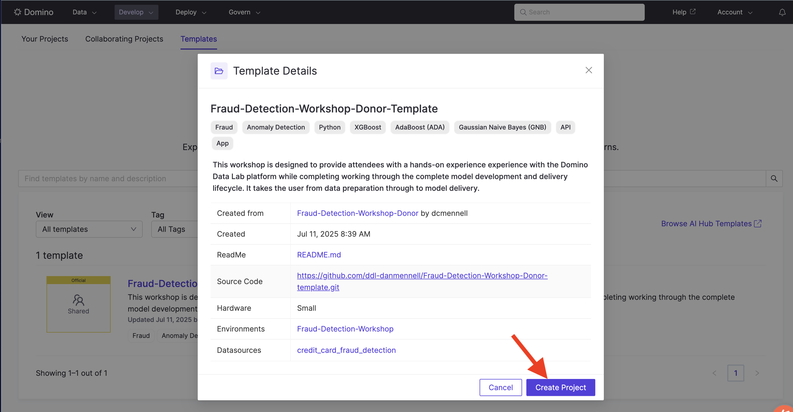
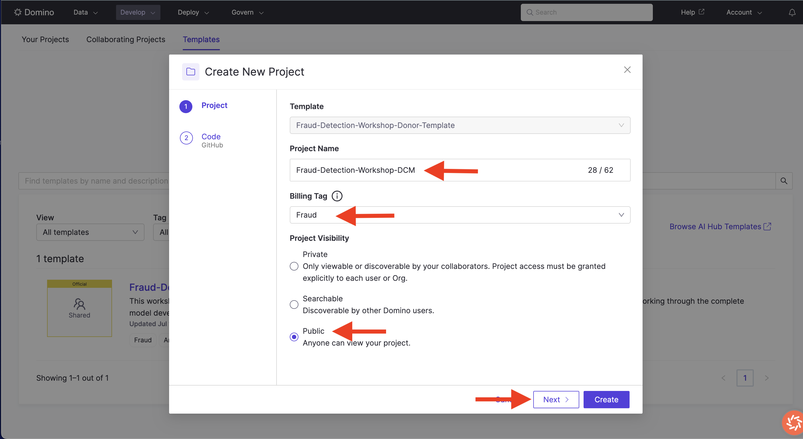
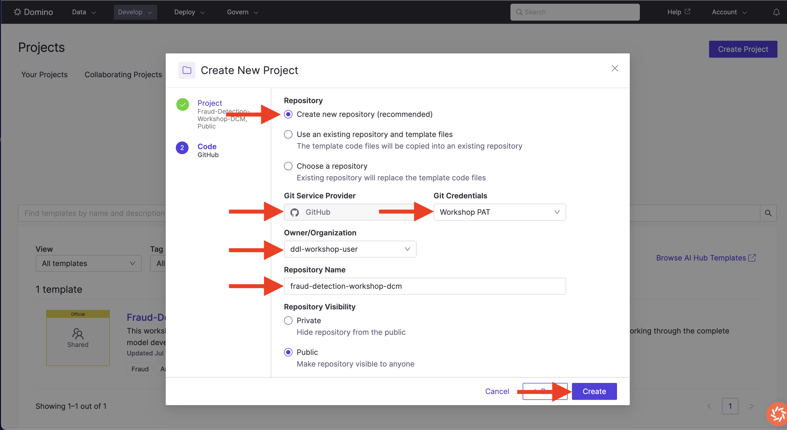

# Up and Running
In this phase, we will be preparing a project in which to build our model.  We will explore the QuickStart project, Examine a Project Template, Create a new Project from a Template, add Contributors to the project, and apply a Governance Policy

## Exercise Instructions

1. Open Domino Website (Explore)

- You can always "Smash Domino" to go home
- Explore Top Navigation Menu

2. Explore the Quickstart Project

- See what makes up a project in the left-hand menu
- Track project actions by clicking on "Activity"

3. Click "Develop" -> "Projects" (Top Menu Bar)

4. Select Templates

5. Click "Fraud-Detection-Workshop-Template"

6. Click "Create Project" button (lower right)

7. Configure the Project page as shown and click "Next"

7. Configure the Code page as shown and click "Create"

8. Explore your new Project

8. Click project "Settings"

9. Click "Access and Sharing"

10. Invite Collaborator under under "Collaborators and Permissions"

11. Set their role to "Contributor"

12. Add another user and set their role to "Results Consumer"

13.  Click "Govern" -> "Bundles" (Left-Hand Column)

14. Click "Create Bundle"

15. Configure Form as shown and click "Create"

16.  Provide a "Business Case" and click "Request Review"

17.  Once review has been approved, "transition Stage to "Stage 2"

This concludes the "1. UP AND RUNNING" section of the workshop

## New Domino Concepts
**Home Page:** 
> When logging in to Domino, you will land on a homepage that gives you quick access to recent work, elevates timely tasks and notifications, and promotes data science assets recently published in your organization.

**Projects:**
> Domino uses Projects to organize work for data science and analytics teams. Projects help teams run experiments and improve code. Using Projects, you can manage data, code, artifacts, and user permissions.

**Project Templates:**
> Project templates are created from an existing project by selecting which assets to include (code, datasets, apps, etc.). With templates created, users can kickstart their projects from a collection of existing prototypes rather than beginning from scratch.

**Governance Policies & Bundles:**
> Policies in Domino define the lifecycle of a scientific output, such as deploying a model to production, building a statistical analysis, or building an AI system.  A governed bundle can be a model, an application, a report, or any other asset developed within the context of a project. It will store all evidence related to the policy it governs and keep the lineage to the relevant attachments.

